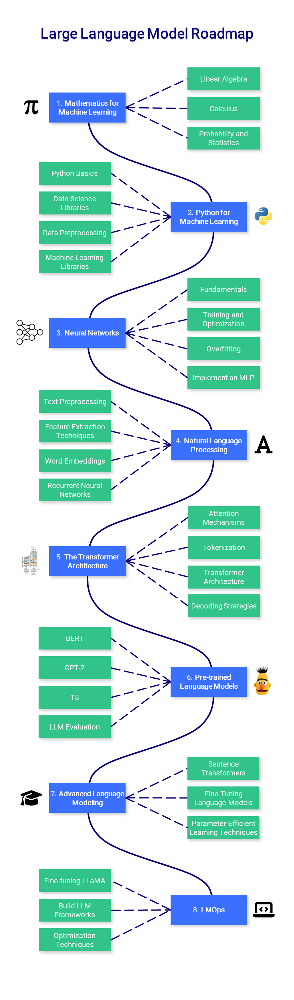

# 🗣️ Large Language Model Course

## Notebooks

A list of notebooks and articles related to large language models.

| Notebook | Description | Article | Notebook |
|---------------------------------------|-------------------------------------------------------------------------|---------------------------------------------------------------------------------------------|------------------------------------------------------------------------------------------------------------------------------------------------------|
| Decoding Strategies in Large Language Models | A guide to text generation from beam search to nucleus sampling | [Article](https://mlabonne.github.io/blog/posts/2022-06-07-Decoding_strategies.html) |  |
| Visualizing GPT-2's Loss Landscape | 3D plot of the loss landscape based on weight pertubations. | [Tweet](https://twitter.com/maximelabonne/status/1667618081844219904) |  |
| Improve ChatGPT with Knowledge Graphs | Augment ChatGPT's answers with knowledge graphs. | [Article](https://mlabonne.github.io/blog/posts/Article_Improve_ChatGPT_with_Knowledge_Graphs.html) |  |

## Roadmap

A step-by-step guide on how to get into large language models with learning resources.

---

### 1. Mathematics for Machine Learning

Before mastering machine learning, it is important to understand the fundamental mathematical concepts that power these algorithms.

- **Linear Algebra**: This is crucial for understanding many algorithms, especially those used in deep learning. Key concepts include vectors, matrices, determinants, eigenvalues and eigenvectors, vector spaces, and linear transformations.
- **Calculus**: Many machine learning algorithms involve the optimization of continuous functions, which requires an understanding of derivatives, integrals, limits, and series. Multivariable calculus and the concept of gradients are also important.
- **Probability and Statistics**: These are crucial for understanding how models learn from data and make predictions. Key concepts include probability theory, random variables, probability distributions, expectations, variance, covariance, correlation, hypothesis testing, confidence intervals, maximum likelihood estimation, and Bayesian inference.

📚 Resources:

- [3Blue1Brown - The Essence of Linear Algebra](https://www.youtube.com/watch?v=fNk_zzaMoSs&list=PLZHQObOWTQDPD3MizzM2xVFitgF8hE_ab): Series of videos that give a geometric intuition to these concepts.
- [StatQuest with Josh Starmer - Statistics Fundamentals](https://www.youtube.com/watch?v=qBigTkBLU6g&list=PLblh5JKOoLUK0FLuzwntyYI10UQFUhsY9): Offers simple and clear explanations for many statistical concepts.
- [AP Statistics Intuition by Ms Aerin](https://automata88.medium.com/list/cacc224d5e7d): List of Medium articles that provide the intuition behind every probability distribution.
- [Immersive Linear Algebra](https://immersivemath.com/ila/learnmore.html): Another visual interpretation of linear algebra.
- [Khan Academy - Linear Algebra](https://www.khanacademy.org/math/linear-algebra): Great for beginners as it explains the concepts in a very intuitive way.
- [Khan Academy - Calculus](https://www.khanacademy.org/math/calculus-1): An interactive course that covers all the basics of calculus.
- [Khan Academy - Probability and Statistics](https://www.khanacademy.org/math/statistics-probability): Delivers the material in an easy-to-understand format.

---

### 2. Python for Machine Learning

Python is a powerful and flexible programming language that's particularly good for machine learning, thanks to its readability, consistency, and robust ecosystem of data science libraries.

- **Python Basics**: Understanding of Python's basic syntax, data types, error handling, and object-oriented programming is crucial.
- **Data Science Libraries**: Familiarity with NumPy for numerical operations, Pandas for data manipulation and analysis, Matplotlib and Seaborn for data visualization is a must.
- **Data Preprocessing**: This involves feature scaling and normalization, handling missing data, outlier detection, categorical data encoding, and splitting data into training, validation, and test sets.
- **Machine Learning Libraries**: Proficiency with Scikit-learn, a library providing a wide selection of supervised and unsupervised learning algorithms, is vital. Understanding how to implement algorithms like linear regression, logistic regression, decision trees, random forests, k-nearest neighbors (K-NN), and K-means clustering is important. Dimensionality reduction techniques like PCA and t-SNE are also very helpful for visualizing high-dimensional data.

📚 Resources:

- [Real Python](https://realpython.com/): A comprehensive resource with articles and tutorials for both beginner and advanced Python concepts.
- [freeCodeCamp - Learn Python](https://www.youtube.com/watch?v=rfscVS0vtbw): Long video that provides a full introduction into all of the core concepts in Python.
- [Python Data Science Handbook](https://jakevdp.github.io/PythonDataScienceHandbook/): Free digital book that is a great resource for learning pandas, NumPy, matplotlib, and Seaborn.
- [freeCodeCamp - Machine Learning for Everybody](https://youtu.be/i_LwzRVP7bg): Practical introduction to different machine learning algorithms for beginners.
- [Udacity - Intro to Machine Learning](https://www.udacity.com/course/intro-to-machine-learning--ud120): Free course that covers PCA and several other machine learning concepts.

---

### 3. Neural Networks

Neural networks are a fundamental part of many machine learning models, particularly in the realm of deep learning. To utilize them effectively, a comprehensive understanding of their design and mechanics is essential.

- **Fundamentals**: This includes understanding the structure of a neural network such as layers, weights, biases, activation functions (sigmoid, tanh, ReLU, etc.)
- **Training and Optimization**: Familiarize yourself with backpropagation and different types of loss functions, like Mean Squared Error (MSE) and Cross-Entropy. Understand various optimization algorithms like Gradient Descent, Stochastic Gradient Descent, RMSprop, and Adam.
- **Overfitting**: It's crucial to comprehend the concept of overfitting (where a model performs well on training data but poorly on unseen data) and various regularization techniques to prevent it. Techniques include dropout, L1/L2 regularization, early stopping, and data augmentation.
- **Implement a Multilayer Perceptron (MLP)**: Build an MLP, also known as a fully connected network, using PyTorch.

📚 Resources:

- [3Blue1Brown - But what is a Neural Network?](https://www.youtube.com/watch?v=aircAruvnKk): This video gives an intuitive explanation of neural networks and their inner workings.
- [freeCodeCamp - Deep Learning Crash Course](https://www.youtube.com/watch?v=VyWAvY2CF9c): This video efficiently introduces all the most important concepts in deep learning.
- [Fast.ai - Practical Deep Learning](https://course.fast.ai/): Free course designed for people with coding experience who want to learn about deep learning.
- [Patrick Loeber - PyTorch Tutorials](https://www.youtube.com/playlist?list=PLqnslRFeH2UrcDBWF5mfPGpqQDSta6VK4): Series of videos for complete beginners to learn about PyTorch.

---

### 4. Natural Language Processing (NLP)

NLP is a fascinating branch of artificial intelligence that bridges the gap between human language and machine understanding. From simple text processing to understanding linguistic nuances, NLP plays a crucial role in many applications like translation, sentiment analysis, chatbots, and much more.

- **Text Preprocessing**: Learn various text preprocessing steps like tokenization (splitting text into words or sentences), stemming (reducing words to their root form), lemmatization (similar to stemming but considers the context), stop word removal, etc.
- **Feature Extraction Techniques**: Become familiar with techniques to convert text data into a format that can be understood by machine learning algorithms. Key methods include Bag-of-words (BoW), Term Frequency-Inverse Document Frequency (TF-IDF), and n-grams.
- **Word Embeddings**: Word embeddings are a type of word representation that allows words with similar meanings to have similar representations. Key methods include Word2Vec, GloVe, and FastText.
- **Recurrent Neural Networks (RNNs)**: Understand the working of RNNs, a type of neural network designed to work with sequence data. Explore LSTMs and GRUs, two RNN variants that are capable of learning long-term dependencies.

📚 Resources:

- [RealPython - NLP with spaCy in Python](https://realpython.com/natural-language-processing-spacy-python/): Exhaustive guide about the spaCy library for NLP tasks in Python.
- [Kaggle - NLP Guide](https://www.kaggle.com/learn-guide/natural-language-processing): A few notebooks and resources for a hands-on explanation of NLP in Python.
- [Jay Alammar - The Illustration Word2Vec](https://jalammar.github.io/illustrated-word2vec/): A good reference to understand the famous Word2Vec architecture.
- [Jake Tae - PyTorch RNN from Scratch](https://jaketae.github.io/study/pytorch-rnn/): Practical and simple implementation of RNN, LSTM, and GRU models in PyTorch.
- [colah's blog - Understanding LSTM Networks](https://colah.github.io/posts/2015-08-Understanding-LSTMs/): A more theoretical article about the LSTM network.

---

### 5. The Transformer Architecture

The Transformer model, introduced in the "Attention is All You Need" paper, is the neural network architecture at the core of large language models. The original paper is difficult to read and eveb contains some mistakes, which is why alternative resources are recommended.

- **Attention Mechanisms**: Grasp the theory behind attention mechanisms, including self-attention and scaled dot-product attention, which allows the model to focus on different parts of the input when producing an output.
- **Tokenization**: Understand how to convert raw text data into a format that the model can understand, which involves splitting the text into tokens (usually words or subwords).
- **Transformer Architecture**: Dive deeper into the architecture of Transformers, learning about their various components such as positional encoding, multi-head attention, feed-forward networks, and normalization layers.
- **Decoding Strategies**: Learn about the different ways the model can generate output sequences. Common strategies include greedy decoding, beam search, and top-k sampling.

📚 Resources:

- [The Illustrated Transformer by Jay Alammar](https://jalammar.github.io/illustrated-transformer/): This is a visual and intuitive explanation of the Transformer model.
- [Hugging Face - NLP Course](https://huggingface.co/learn/nlp-course/): An excellent mini-course that goes beyond the Transformer architecture.
- [Harvard - The Annotated Transformer](https://nlp.seas.harvard.edu/annotated-transformer/): An excellent in-depth article about the original Transformer paper.
- [Introduction to the Transformer by Rachel Thomas](https://www.youtube.com/watch?v=AFkGPmU16QA): Provides a good intuition behind the main ideas of the Transformer architecture.
- [Stanford CS224N - Transformers](https://www.youtube.com/watch?v=ptuGllU5SQQ): A more academic presentation of this architecture.

---

### 6. Pre-trained Language Models

Pre-trained models like BERT, GPT-2, and T5 are powerful tools that can handle tasks like sequence classification, text generation, text summarization, and question answering.

- **BERT**: Understand BERT's architecture, including the concept of bidirectional training, which distinguishes it from previous models. Learn about fine-tuning BERT for tasks like sequence classification, named entity recognition, and question answering.
- **GPT-2**: Understand GPT-2's decoder-only architecture and its pre-training objective. Learn to use it for text generation.
- **T5**: the T5 model is a highly versatile model for tasks ranging from text classification to translation to summarization. Understand how to train and use T5 for multiple tasks, and learn about the "prefix-tuning" approach used with T5.
- **LLM Evaluation**: Learn how to evaluate the performance of these models on your specific task, including appropriate metrics for different tasks such as accuracy, F1 score, BLEU score, or perplexity.

📚 Resources:

- [The Illustrated BERT by Jay Alammar](https://jalammar.github.io/illustrated-bert/): Another excellent visual guide to the BERT architecture.
- [Hugging Face - BERT](https://huggingface.co/docs/transformers/v4.30.0/en/model_doc/bert#overview): Overview and list of practical resources for various tasks.
- [The Illustrated GPT-2 by Jay Alammar](https://jalammar.github.io/illustrated-gpt2/): In-depth illustrated guide to the GPT-2 architecture.
- [T5 paper](https://arxiv.org/abs/1910.10683): The original paper that introduced the T5 model and many essential concepts for modern NLP.
- [Hugging Face - Transformers Notebooks](https://huggingface.co/docs/transformers/notebooks): List of official notebooks provided by Hugging Face.
- [Hugging Face - Metrics](https://huggingface.co/metrics): All metrics on the Hugging Face hub.

---

### 7. Advanced Language Modeling

To fine-tune your skills, learn how to create embeddings with sentence transformers, store them in a vector database, and use parameter-efficient supervised learning or RLHF to fine-tune LLMs.

- **Sentence Transformers**: Sentence Transformers are models that can derive semantically meaningful embeddings for sentences, paragraphs, or texts. Learn how to store and retrieve these embeddings using an appropriate vector database for rapid similarity search.
- **Fine-Tuning Language Models**: After understanding and using pre-trained models, the next step is fine-tuning them on a domain-specific dataset. It allows the model to be more accurate for certain tasks or domains, such as medical text analysis or sentiment analysis for movie reviews.
- **Parameter-Efficient Learning Techniques**: Explore more efficient ways to train or fine-tune your models without requiring massive amounts of data or computational resources, such as LoRA.

📚 Resources:

- [SBERT.net](https://www.sbert.net/): Python library to implement sentence transformers, with a lot of examples.
- [Pinecone - Sentence Transformers](https://www.pinecone.io/learn/sentence-embeddings/): Mini-book about NLP for semantic search in general.
- [Hugging Face - RLHF](https://huggingface.co/blog/rlhf): Blog post introducing the concept of RLHF.
- [Hugging Face - PEFT](https://huggingface.co/blog/peft): Another library from Hugging Face implementing different techniques, such as LoRA.
- [Efficient LLM training by Phil Schmid](https://www.philschmid.de/fine-tune-flan-t5-peft): Implementation of LoRA to fine-tune a Flan-T5 model.

---

### 8. LMOps

Finally, dive into Language Model Operations (LMOps), learn how to handle prompt engineering, build frameworks with Langchain and Llamaindex, and optimize inference with weight quantization, pruning, distillation, and more.

- **Fine-tuning LLaMA**: Instruction fine-tuning has become extremely popular since the (accidental) release of LLaMA. The size of these models and the peculiarities of training them on instructions and answers introduce more complexity and often require parameter-efficient learning techniques such as QLoRA.
- **Build LLM Frameworks**: LLMs are a new building block in system design, where the rest of the architecture is handled by libraries such as LangChain and LlamaIndex, allowing you to query vector databases, improving the model's memory or providing various tools.
- **Optimization Techniques for Inference**: As the size of LLMs grows, it becomes increasingly important to apply optimization techniques to ensure that the models can be efficiently used for inference. Techniques include weight quantization (4-bit, 3-bit), pruning, knowledge distillation, etc.
- **LLM deployment**: These models can be deployed locally like [llama.cpp](https://github.com/ggerganov/llama.cpp) or in the cloud like Hugging Face's [text generation inference](https://github.com/huggingface/text-generation-inference) or [vLLM](https://github.com/vllm-project/vllm).

📚 Resources:

- [MLExpert - Fine-tuning Alpaca](https://www.mlexpert.io/machine-learning/tutorials/alpaca-fine-tuning): Guide to fine-tune LLaMA on a custom dataset.
- [Hugging Face - LLM.int8()](https://huggingface.co/blog/hf-bitsandbytes-integration): Introduction to 8-bit matrix multiplication with LLM.int8().
- [Hugging Face - QLoRA](https://huggingface.co/blog/4bit-transformers-bitsandbytes): Blog post introducing QLoRA with notebooks to test it.
- [Kanaries - AutoGPTQ](https://docs.kanaries.net/tutorials/ChatGPT/auto-gptq): Simple guide to use AutoGPTQ.
- [Emerging Architectures for LLM Applications](https://a16z.com/2023/06/20/emerging-architectures-for-llm-applications/): overview of the LLM app stack.
- [Pinecone - LangChain AI Handbook](https://www.pinecone.io/learn/langchain-intro/): Excellent free book on how to master the LangChain library.
- [A Primer to using LlamaIndex](https://gpt-index.readthedocs.io/en/latest/guides/primer.html): Official guides to learn more about LlamaIndex.

---

### Acknowledgements

This roadmap was inspired by the excellent [DevOps Roadmap](https://github.com/milanm/DevOps-Roadmap) from Milan Milanović and Romano Roth.

Special thanks to Thomas Thelen for motivating me to create a roadmap, and André Frade for his input and review of the first draft.

*Disclaimer: I am not affiliated with any sources listed here.*
