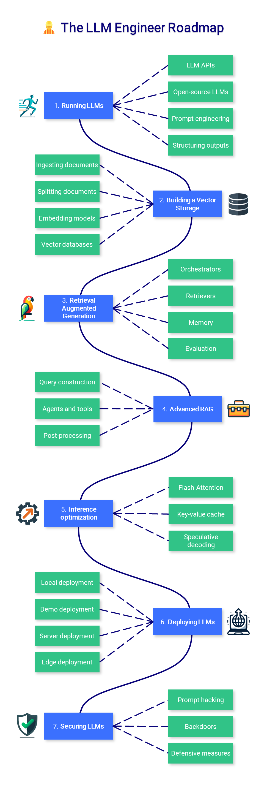

  <h1>🗣️ Large Language Model Course</h1>
  

    🐦 <a href="https://twitter.com/maximelabonne">Follow me on X</a> • 
    🤗 <a href="https://huggingface.co/mlabonne">Hugging Face</a> • 
    💻 <a href="https://mlabonne.github.io/blog">Blog</a> • 
    📙 <a href="https://github.com/PacktPublishing/Hands-On-Graph-Neural-Networks-Using-Python">Hands-on GNN</a>
  

 

The LLM course is divided into three parts:

1. 🧩 **LLM Fundamentals** covers essential knowledge about mathematics, Python, and neural networks.
2. 🧑‍🔬 **The LLM Scientist** focuses on building the best possible LLMs using the latest techniques.
3. 👷 **The LLM Engineer** focuses on creating LLM-based applications and deploying them.

For an interactive version of this course, I created two **LLM assistants** that will answer questions and test your knowledge in a personalized way:

* 🤗 [**HuggingChat Assistant**](https://hf.co/chat/assistant/66029d2e5f4a884f7aabc9d1): Free version using Mixtral-8x7B.
* 🤖 [**ChatGPT Assistant**](https://chat.openai.com/g/g-yviLuLqvI-llm-course): Requires a premium account.

## 📝 Notebooks

A list of notebooks and articles related to large language models.

### Tools

| Notebook | Description | Notebook |
|----------|-------------|----------|
| 🧐 [LLM AutoEval](https://github.com/mlabonne/llm-autoeval) | Automatically evaluate your LLMs using RunPod |  |
| 🥱 LazyMergekit | Easily merge models using MergeKit in one click. |  |
| 🦎 LazyAxolotl | Fine-tune models in the cloud using Axolotl in one click. |  |
| ⚡ AutoQuant | Quantize LLMs in GGUF, GPTQ, EXL2, AWQ, and HQQ formats in one click. |  |
| 🌳 Model Family Tree | Visualize the family tree of merged models. |  |
| 🚀 ZeroSpace | Automatically create a Gradio chat interface using a free ZeroGPU. |  |

### Fine-tuning

| Notebook | Description | Article | Notebook |
|---------------------------------------|-------------------------------------------------------------------------|---------------------------------------------------------------------------------------------|------------------------------------------------------------------------------------------------------------------------------------------------------|
| Fine-tune Llama 2 with QLoRA | Step-by-step guide to supervised fine-tune Llama 2 in Google Colab. | [Article](https://mlabonne.github.io/blog/posts/Fine_Tune_Your_Own_Llama_2_Model_in_a_Colab_Notebook.html) |  |
| Fine-tune CodeLlama using Axolotl | End-to-end guide to the state-of-the-art tool for fine-tuning. | [Article](https://mlabonne.github.io/blog/posts/A_Beginners_Guide_to_LLM_Finetuning.html) |  |
| Fine-tune Mistral-7b with QLoRA | Supervised fine-tune Mistral-7b in a free-tier Google Colab with TRL. |  |  |
| Fine-tune Mistral-7b with DPO | Boost the performance of supervised fine-tuned models with DPO. | [Article](https://mlabonne.github.io/blog/posts/Fine_tune_Mistral_7b_with_DPO.html) |  |
| Fine-tune Llama 3 with ORPO | Cheaper and faster fine-tuning in a single stage with ORPO. | [Article](https://mlabonne.github.io/blog/posts/2024-04-19_Fine_tune_Llama_3_with_ORPO.html) |  |
| Fine-tune Llama 3.1 with Unsloth | Ultra-efficient supervised fine-tuning in Google Colab. | [Article](https://mlabonne.github.io/blog/posts/2024-07-29_Finetune_Llama31.html) |  |

### Quantization

| Notebook | Description | Article | Notebook |
|---------------------------------------|-------------------------------------------------------------------------|---------------------------------------------------------------------------------------------|------------------------------------------------------------------------------------------------------------------------------------------------------|
| Introduction to Quantization | Large language model optimization using 8-bit quantization. | [Article](https://mlabonne.github.io/blog/posts/Introduction_to_Weight_Quantization.html) |  |
| 4-bit Quantization using GPTQ | Quantize your own open-source LLMs to run them on consumer hardware. | [Article](https://mlabonne.github.io/blog/4bit_quantization/) |  |
| Quantization with GGUF and llama.cpp | Quantize Llama 2 models with llama.cpp and upload GGUF versions to the HF Hub. | [Article](https://mlabonne.github.io/blog/posts/Quantize_Llama_2_models_using_ggml.html) |  |
| ExLlamaV2: The Fastest Library to Run LLMs | Quantize and run EXL2 models and upload them to the HF Hub. | [Article](https://mlabonne.github.io/blog/posts/ExLlamaV2_The_Fastest_Library_to_Run%C2%A0LLMs.html) |  |

### Other

| Notebook | Description | Article | Notebook |
|---------------------------------------|-------------------------------------------------------------------------|---------------------------------------------------------------------------------------------|------------------------------------------------------------------------------------------------------------------------------------------------------|
| Decoding Strategies in Large Language Models | A guide to text generation from beam search to nucleus sampling | [Article](https://mlabonne.github.io/blog/posts/2022-06-07-Decoding_strategies.html) |  |
| Improve ChatGPT with Knowledge Graphs | Augment ChatGPT's answers with knowledge graphs. | [Article](https://mlabonne.github.io/blog/posts/Article_Improve_ChatGPT_with_Knowledge_Graphs.html) |  |
| Merge LLMs with MergeKit | Create your own models easily, no GPU required! | [Article](https://mlabonne.github.io/blog/posts/2024-01-08_Merge_LLMs_with_mergekit%20copy.html) |  |
| Create MoEs with MergeKit | Combine multiple experts into a single frankenMoE | [Article](https://mlabonne.github.io/blog/posts/2024-03-28_Create_Mixture_of_Experts_with_MergeKit.html) |  |
| Uncensor any LLM with abliteration | Fine-tuning without retraining | [Article](https://mlabonne.github.io/blog/posts/2024-06-04_Uncensor_any_LLM_with_abliteration.html) |  |

## 🧩 LLM Fundamentals

This section introduces essential knowledge about mathematics, Python, and neural networks. You might not want to start here but refer to it as needed.

Toggle section

  

### 1. Mathematics for Machine Learning

Before mastering machine learning, it is important to understand the fundamental mathematical concepts that power these algorithms.

- **Linear Algebra**: This is crucial for understanding many algorithms, especially those used in deep learning. Key concepts include vectors, matrices, determinants, eigenvalues and eigenvectors, vector spaces, and linear transformations.
- **Calculus**: Many machine learning algorithms involve the optimization of continuous functions, which requires an understanding of derivatives, integrals, limits, and series. Multivariable calculus and the concept of gradients are also important.
- **Probability and Statistics**: These are crucial for understanding how models learn from data and make predictions. Key concepts include probability theory, random variables, probability distributions, expectations, variance, covariance, correlation, hypothesis testing, confidence intervals, maximum likelihood estimation, and Bayesian inference.

📚 Resources:

- [3Blue1Brown - The Essence of Linear Algebra](https://www.youtube.com/watch?v=fNk_zzaMoSs&list=PLZHQObOWTQDPD3MizzM2xVFitgF8hE_ab): Series of videos that give a geometric intuition to these concepts.
- [StatQuest with Josh Starmer - Statistics Fundamentals](https://www.youtube.com/watch?v=qBigTkBLU6g&list=PLblh5JKOoLUK0FLuzwntyYI10UQFUhsY9): Offers simple and clear explanations for many statistical concepts.
- [AP Statistics Intuition by Ms Aerin](https://automata88.medium.com/list/cacc224d5e7d): List of Medium articles that provide the intuition behind every probability distribution.
- [Immersive Linear Algebra](https://immersivemath.com/ila/learnmore.html): Another visual interpretation of linear algebra.
- [Khan Academy - Linear Algebra](https://www.khanacademy.org/math/linear-algebra): Great for beginners as it explains the concepts in a very intuitive way.
- [Khan Academy - Calculus](https://www.khanacademy.org/math/calculus-1): An interactive course that covers all the basics of calculus.
- [Khan Academy - Probability and Statistics](https://www.khanacademy.org/math/statistics-probability): Delivers the material in an easy-to-understand format.

---

### 2. Python for Machine Learning

Python is a powerful and flexible programming language that's particularly good for machine learning, thanks to its readability, consistency, and robust ecosystem of data science libraries.

- **Python Basics**: Python programming requires a good understanding of the basic syntax, data types, error handling, and object-oriented programming.
- **Data Science Libraries**: It includes familiarity with NumPy for numerical operations, Pandas for data manipulation and analysis, Matplotlib and Seaborn for data visualization.
- **Data Preprocessing**: This involves feature scaling and normalization, handling missing data, outlier detection, categorical data encoding, and splitting data into training, validation, and test sets.
- **Machine Learning Libraries**: Proficiency with Scikit-learn, a library providing a wide selection of supervised and unsupervised learning algorithms, is vital. Understanding how to implement algorithms like linear regression, logistic regression, decision trees, random forests, k-nearest neighbors (K-NN), and K-means clustering is important. Dimensionality reduction techniques like PCA and t-SNE are also helpful for visualizing high-dimensional data.

📚 Resources:

- [Real Python](https://realpython.com/): A comprehensive resource with articles and tutorials for both beginner and advanced Python concepts.
- [freeCodeCamp - Learn Python](https://www.youtube.com/watch?v=rfscVS0vtbw): Long video that provides a full introduction into all of the core concepts in Python.
- [Python Data Science Handbook](https://jakevdp.github.io/PythonDataScienceHandbook/): Free digital book that is a great resource for learning pandas, NumPy, Matplotlib, and Seaborn.
- [freeCodeCamp - Machine Learning for Everybody](https://youtu.be/i_LwzRVP7bg): Practical introduction to different machine learning algorithms for beginners.
- [Udacity - Intro to Machine Learning](https://www.udacity.com/course/intro-to-machine-learning--ud120): Free course that covers PCA and several other machine learning concepts.

---

### 3. Neural Networks

Neural networks are a fundamental part of many machine learning models, particularly in the realm of deep learning. To utilize them effectively, a comprehensive understanding of their design and mechanics is essential.

- **Fundamentals**: This includes understanding the structure of a neural network such as layers, weights, biases, and activation functions (sigmoid, tanh, ReLU, etc.)
- **Training and Optimization**: Familiarize yourself with backpropagation and different types of loss functions, like Mean Squared Error (MSE) and Cross-Entropy. Understand various optimization algorithms like Gradient Descent, Stochastic Gradient Descent, RMSprop, and Adam.
- **Overfitting**: Understand the concept of overfitting (where a model performs well on training data but poorly on unseen data) and learn various regularization techniques (dropout, L1/L2 regularization, early stopping, data augmentation) to prevent it.
- **Implement a Multilayer Perceptron (MLP)**: Build an MLP, also known as a fully connected network, using PyTorch.

📚 Resources:

- [3Blue1Brown - But what is a Neural Network?](https://www.youtube.com/watch?v=aircAruvnKk): This video gives an intuitive explanation of neural networks and their inner workings.
- [freeCodeCamp - Deep Learning Crash Course](https://www.youtube.com/watch?v=VyWAvY2CF9c): This video efficiently introduces all the most important concepts in deep learning.
- [Fast.ai - Practical Deep Learning](https://course.fast.ai/): Free course designed for people with coding experience who want to learn about deep learning.
- [Patrick Loeber - PyTorch Tutorials](https://www.youtube.com/playlist?list=PLqnslRFeH2UrcDBWF5mfPGpqQDSta6VK4): Series of videos for complete beginners to learn about PyTorch.

---

### 4. Natural Language Processing (NLP)

NLP is a fascinating branch of artificial intelligence that bridges the gap between human language and machine understanding. From simple text processing to understanding linguistic nuances, NLP plays a crucial role in many applications like translation, sentiment analysis, chatbots, and much more.

- **Text Preprocessing**: Learn various text preprocessing steps like tokenization (splitting text into words or sentences), stemming (reducing words to their root form), lemmatization (similar to stemming but considers the context), stop word removal, etc.
- **Feature Extraction Techniques**: Become familiar with techniques to convert text data into a format that can be understood by machine learning algorithms. Key methods include Bag-of-words (BoW), Term Frequency-Inverse Document Frequency (TF-IDF), and n-grams.
- **Word Embeddings**: Word embeddings are a type of word representation that allows words with similar meanings to have similar representations. Key methods include Word2Vec, GloVe, and FastText.
- **Recurrent Neural Networks (RNNs)**: Understand the working of RNNs, a type of neural network designed to work with sequence data. Explore LSTMs and GRUs, two RNN variants that are capable of learning long-term dependencies.

📚 Resources:

- [RealPython - NLP with spaCy in Python](https://realpython.com/natural-language-processing-spacy-python/): Exhaustive guide about the spaCy library for NLP tasks in Python.
- [Kaggle - NLP Guide](https://www.kaggle.com/learn-guide/natural-language-processing): A few notebooks and resources for a hands-on explanation of NLP in Python.
- [Jay Alammar - The Illustration Word2Vec](https://jalammar.github.io/illustrated-word2vec/): A good reference to understand the famous Word2Vec architecture.
- [Jake Tae - PyTorch RNN from Scratch](https://jaketae.github.io/study/pytorch-rnn/): Practical and simple implementation of RNN, LSTM, and GRU models in PyTorch.
- [colah's blog - Understanding LSTM Networks](https://colah.github.io/posts/2015-08-Understanding-LSTMs/): A more theoretical article about the LSTM network.

## 🧑‍🔬 The LLM Scientist

This section of the course focuses on learning how to build the best possible LLMs using the latest techniques.

### 1. The LLM architecture

While an in-depth knowledge about the Transformer architecture is not required, it is important to have a good understanding of its inputs (tokens) and outputs (logits). The vanilla attention mechanism is another crucial component to master, as improved versions of it are introduced later on.

* **High-level view**: Revisit the encoder-decoder Transformer architecture, and more specifically the decoder-only GPT architecture, which is used in every modern LLM.
* **Tokenization**: Understand how to convert raw text data into a format that the model can understand, which involves splitting the text into tokens (usually words or subwords).
* **Attention mechanisms**: Grasp the theory behind attention mechanisms, including self-attention and scaled dot-product attention, which allows the model to focus on different parts of the input when producing an output.
* **Text generation**: Learn about the different ways the model can generate output sequences. Common strategies include greedy decoding, beam search, top-k sampling, and nucleus sampling.

📚 **References**:
* [The Illustrated Transformer](https://jalammar.github.io/illustrated-transformer/) by Jay Alammar: A visual and intuitive explanation of the Transformer model.
* [The Illustrated GPT-2](https://jalammar.github.io/illustrated-gpt2/) by Jay Alammar: Even more important than the previous article, it is focused on the GPT architecture, which is very similar to Llama's.
* [Visual intro to Transformers](https://www.youtube.com/watch?v=wjZofJX0v4M&t=187s) by 3Blue1Brown: Simple easy to understand visual intro to Transformers
* [LLM Visualization](https://bbycroft.net/llm) by Brendan Bycroft: Incredible 3D visualization of what happens inside of an LLM.
* [nanoGPT](https://www.youtube.com/watch?v=kCc8FmEb1nY) by Andrej Karpathy: A 2h-long YouTube video to reimplement GPT from scratch (for programmers).
* [Attention? Attention!](https://lilianweng.github.io/posts/2018-06-24-attention/) by Lilian Weng: Introduce the need for attention in a more formal way.
* [Decoding Strategies in LLMs](https://mlabonne.github.io/blog/posts/2023-06-07-Decoding_strategies.html): Provide code and a visual introduction to the different decoding strategies to generate text.

---
### 2. Building an instruction dataset

While it's easy to find raw data from Wikipedia and other websites, it's difficult to collect pairs of instructions and answers in the wild. Like in traditional machine learning, the quality of the dataset will directly influence the quality of the model, which is why it might be the most important component in the fine-tuning process.

* **[Alpaca](https://crfm.stanford.edu/2023/03/13/alpaca.html)-like dataset**: Generate synthetic data from scratch with the OpenAI API (GPT). You can specify seeds and system prompts to create a diverse dataset.
* **Advanced techniques**: Learn how to improve existing datasets with [Evol-Instruct](https://arxiv.org/abs/2304.12244), how to generate high-quality synthetic data like in the [Orca](https://arxiv.org/abs/2306.02707) and [phi-1](https://arxiv.org/abs/2306.11644) papers.
* **Filtering data**: Traditional techniques involving regex, removing near-duplicates, focusing on answers with a high number of tokens, etc.
* **Prompt templates**: There's no true standard way of formatting instructions and answers, which is why it's important to know about the different chat templates, such as [ChatML](https://learn.microsoft.com/en-us/azure/ai-services/openai/how-to/chatgpt?tabs=python&pivots=programming-language-chat-ml), [Alpaca](https://crfm.stanford.edu/2023/03/13/alpaca.html), etc.

📚 **References**:
* [Preparing a Dataset for Instruction tuning](https://wandb.ai/capecape/alpaca_ft/reports/How-to-Fine-Tune-an-LLM-Part-1-Preparing-a-Dataset-for-Instruction-Tuning--Vmlldzo1NTcxNzE2) by Thomas Capelle: Exploration of the Alpaca and Alpaca-GPT4 datasets and how to format them.
* [Generating a Clinical Instruction Dataset](https://medium.com/mlearning-ai/generating-a-clinical-instruction-dataset-in-portuguese-with-langchain-and-gpt-4-6ee9abfa41ae) by Solano Todeschini: Tutorial on how to create a synthetic instruction dataset using GPT-4. 
* [GPT 3.5 for news classification](https://medium.com/@kshitiz.sahay26/how-i-created-an-instruction-dataset-using-gpt-3-5-to-fine-tune-llama-2-for-news-classification-ed02fe41c81f) by Kshitiz Sahay: Use GPT 3.5 to create an instruction dataset to fine-tune Llama 2 for news classification.
* [Dataset creation for fine-tuning LLM](https://colab.research.google.com/drive/1GH8PW9-zAe4cXEZyOIE-T9uHXblIldAg?usp=sharing): Notebook that contains a few techniques to filter a dataset and upload the result.
* [Chat Template](https://huggingface.co/blog/chat-templates) by Matthew Carrigan: Hugging Face's page about prompt templates

---
### 3. Pre-training models

Pre-training is a very long and costly process, which is why this is not the focus of this course. It's good to have some level of understanding of what happens during pre-training, but hands-on experience is not required.

* **Data pipeline**: Pre-training requires huge datasets (e.g., [Llama 2](https://arxiv.org/abs/2307.09288) was trained on 2 trillion tokens) that need to be filtered, tokenized, and collated with a pre-defined vocabulary.
* **Causal language modeling**: Learn the difference between causal and masked language modeling, as well as the loss function used in this case. For efficient pre-training, learn more about [Megatron-LM](https://github.com/NVIDIA/Megatron-LM) or [gpt-neox](https://github.com/EleutherAI/gpt-neox).
* **Scaling laws**: The [scaling laws](https://arxiv.org/pdf/2001.08361.pdf) describe the expected model performance based on the model size, dataset size, and the amount of compute used for training.
* **High-Performance Computing**: Out of scope here, but more knowledge about HPC is fundamental if you're planning to create your own LLM from scratch (hardware, distributed workload, etc.).

📚 **References**:
* [LLMDataHub](https://github.com/Zjh-819/LLMDataHub) by Junhao Zhao: Curated list of datasets for pre-training, fine-tuning, and RLHF.
* [Training a causal language model from scratch](https://huggingface.co/learn/nlp-course/chapter7/6?fw=pt) by Hugging Face: Pre-train a GPT-2 model from scratch using the transformers library.
* [TinyLlama](https://github.com/jzhang38/TinyLlama) by Zhang et al.: Check this project to get a good understanding of how a Llama model is trained from scratch.
* [Causal language modeling](https://huggingface.co/docs/transformers/tasks/language_modeling) by Hugging Face: Explain the difference between causal and masked language modeling and how to quickly fine-tune a DistilGPT-2 model.
* [Chinchilla's wild implications](https://www.lesswrong.com/posts/6Fpvch8RR29qLEWNH/chinchilla-s-wild-implications) by nostalgebraist: Discuss the scaling laws and explain what they mean to LLMs in general.
* [BLOOM](https://bigscience.notion.site/BLOOM-BigScience-176B-Model-ad073ca07cdf479398d5f95d88e218c4) by BigScience: Notion page that describes how the BLOOM model was built, with a lot of useful information about the engineering part and the problems that were encountered.
* [OPT-175 Logbook](https://github.com/facebookresearch/metaseq/blob/main/projects/OPT/chronicles/OPT175B_Logbook.pdf) by Meta: Research logs showing what went wrong and what went right. Useful if you're planning to pre-train a very large language model (in this case, 175B parameters).
* [LLM 360](https://www.llm360.ai/): A framework for open-source LLMs with training and data preparation code, data, metrics, and models.

---
### 4. Supervised Fine-Tuning

Pre-trained models are only trained on a next-token prediction task, which is why they're not helpful assistants. SFT allows you to tweak them to respond to instructions. Moreover, it allows you to fine-tune your model on any data (private, not seen by GPT-4, etc.) and use it without having to pay for an API like OpenAI's.

* **Full fine-tuning**: Full fine-tuning refers to training all the parameters in the model. It is not an efficient technique, but it produces slightly better results.
* [**LoRA**](https://arxiv.org/abs/2106.09685): A parameter-efficient technique (PEFT) based on low-rank adapters. Instead of training all the parameters, we only train these adapters.
* [**QLoRA**](https://arxiv.org/abs/2305.14314): Another PEFT based on LoRA, which also quantizes the weights of the model in 4 bits and introduce paged optimizers to manage memory spikes. Combine it with [Unsloth](https://github.com/unslothai/unsloth) to run it efficiently on a free Colab notebook.
* **[Axolotl](https://github.com/OpenAccess-AI-Collective/axolotl)**: A user-friendly and powerful fine-tuning tool that is used in a lot of state-of-the-art open-source models.
* [**DeepSpeed**](https://www.deepspeed.ai/): Efficient pre-training and fine-tuning of LLMs for multi-GPU and multi-node settings (implemented in Axolotl).

📚 **References**:
* [The Novice's LLM Training Guide](https://rentry.org/llm-training) by Alpin: Overview of the main concepts and parameters to consider when fine-tuning LLMs.
* [LoRA insights](https://lightning.ai/pages/community/lora-insights/) by Sebastian Raschka: Practical insights about LoRA and how to select the best parameters.
* [Fine-Tune Your Own Llama 2 Model](https://mlabonne.github.io/blog/posts/Fine_Tune_Your_Own_Llama_2_Model_in_a_Colab_Notebook.html): Hands-on tutorial on how to fine-tune a Llama 2 model using Hugging Face libraries.
* [Padding Large Language Models](https://towardsdatascience.com/padding-large-language-models-examples-with-llama-2-199fb10df8ff) by Benjamin Marie: Best practices to pad training examples for causal LLMs
* [A Beginner's Guide to LLM Fine-Tuning](https://mlabonne.github.io/blog/posts/A_Beginners_Guide_to_LLM_Finetuning.html): Tutorial on how to fine-tune a CodeLlama model using Axolotl.

---
### 5. Preference Alignment

After supervised fine-tuning, RLHF is a step used to align the LLM's answers with human expectations. The idea is to learn preferences from human (or artificial) feedback, which can be used to reduce biases, censor models, or make them act in a more useful way. It is more complex than SFT and often seen as optional.

* **Preference datasets**: These datasets typically contain several answers with some kind of ranking, which makes them more difficult to produce than instruction datasets.
* [**Proximal Policy Optimization**](https://arxiv.org/abs/1707.06347): This algorithm leverages a reward model that predicts whether a given text is highly ranked by humans. This prediction is then used to optimize the SFT model with a penalty based on KL divergence.
* **[Direct Preference Optimization](https://arxiv.org/abs/2305.18290)**: DPO simplifies the process by reframing it as a classification problem. It uses a reference model instead of a reward model (no training needed) and only requires one hyperparameter, making it more stable and efficient.

📚 **References**:
* [Distilabel](https://github.com/argilla-io/distilabel) by Argilla: Excellent tool to create your own datasets. It was especially designed for preference datasets but can also do SFT.
* [An Introduction to Training LLMs using RLHF](https://wandb.ai/ayush-thakur/Intro-RLAIF/reports/An-Introduction-to-Training-LLMs-Using-Reinforcement-Learning-From-Human-Feedback-RLHF---VmlldzozMzYyNjcy) by Ayush Thakur: Explain why RLHF is desirable to reduce bias and increase performance in LLMs.
* [Illustration RLHF](https://huggingface.co/blog/rlhf) by Hugging Face: Introduction to RLHF with reward model training and fine-tuning with reinforcement learning.
* [Preference Tuning LLMs](https://huggingface.co/blog/pref-tuning) by Hugging Face: Comparison of the DPO, IPO, and KTO algorithms to perform preference alignment.
* [LLM Training: RLHF and Its Alternatives](https://magazine.sebastianraschka.com/p/llm-training-rlhf-and-its-alternatives) by Sebastian Rashcka: Overview of the RLHF process and alternatives like RLAIF.
* [Fine-tune Mistral-7b with DPO](https://mlabonne.github.io/blog/posts/Fine_tune_Mistral_7b_with_DPO.html): Tutorial to fine-tune a Mistral-7b model with DPO and reproduce [NeuralHermes-2.5](https://huggingface.co/mlabonne/NeuralHermes-2.5-Mistral-7B).

---
### 6. Evaluation

Evaluating LLMs is an undervalued part of the pipeline, which is time-consuming and moderately reliable. Your downstream task should dictate what you want to evaluate, but always remember Goodhart's law: "When a measure becomes a target, it ceases to be a good measure."

* **Traditional metrics**: Metrics like perplexity and BLEU score are not as popular as they were because they're flawed in most contexts. It is still important to understand them and when they can be applied.
* **General benchmarks**: Based on the [Language Model Evaluation Harness](https://github.com/EleutherAI/lm-evaluation-harness), the [Open LLM Leaderboard](https://huggingface.co/spaces/HuggingFaceH4/open_llm_leaderboard) is the main benchmark for general-purpose LLMs (like ChatGPT). There are other popular benchmarks like [BigBench](https://github.com/google/BIG-bench), [MT-Bench](https://arxiv.org/abs/2306.05685), etc.
* **Task-specific benchmarks**: Tasks like summarization, translation, and question answering have dedicated benchmarks, metrics, and even subdomains (medical, financial, etc.), such as [PubMedQA](https://pubmedqa.github.io/) for biomedical question answering.
* **Human evaluation**: The most reliable evaluation is the acceptance rate by users or comparisons made by humans. Logging user feedback in addition to the chat traces (e.g., using [LangSmith](https://docs.smith.langchain.com/evaluation/capturing-feedback)) helps to identify potential areas for improvement.

📚 **References**:
* [Perplexity of fixed-length models](https://huggingface.co/docs/transformers/perplexity) by Hugging Face: Overview of perplexity with code to implement it with the transformers library.
* [BLEU at your own risk](https://towardsdatascience.com/evaluating-text-output-in-nlp-bleu-at-your-own-risk-e8609665a213) by Rachael Tatman: Overview of the BLEU score and its many issues with examples.
* [A Survey on Evaluation of LLMs](https://arxiv.org/abs/2307.03109) by Chang et al.: Comprehensive paper about what to evaluate, where to evaluate, and how to evaluate.
* [Chatbot Arena Leaderboard](https://huggingface.co/spaces/lmsys/chatbot-arena-leaderboard) by lmsys: Elo rating of general-purpose LLMs, based on comparisons made by humans.

---
### 7. Quantization

Quantization is the process of converting the weights (and activations) of a model using a lower precision. For example, weights stored using 16 bits can be converted into a 4-bit representation. This technique has become increasingly important to reduce the computational and memory costs associated with LLMs.

* **Base techniques**: Learn the different levels of precision (FP32, FP16, INT8, etc.) and how to perform naïve quantization with absmax and zero-point techniques.
* **GGUF and llama.cpp**: Originally designed to run on CPUs, [llama.cpp](https://github.com/ggerganov/llama.cpp) and the GGUF format have become the most popular tools to run LLMs on consumer-grade hardware.
* **GPTQ and EXL2**: [GPTQ](https://arxiv.org/abs/2210.17323) and, more specifically, the [EXL2](https://github.com/turboderp/exllamav2) format offer an incredible speed but can only run on GPUs. Models also take a long time to be quantized.
* **AWQ**: This new format is more accurate than GPTQ (lower perplexity) but uses a lot more VRAM and is not necessarily faster.

📚 **References**:
* [Introduction to quantization](https://mlabonne.github.io/blog/posts/Introduction_to_Weight_Quantization.html): Overview of quantization, absmax and zero-point quantization, and LLM.int8() with code.
* [Quantize Llama models with llama.cpp](https://mlabonne.github.io/blog/posts/Quantize_Llama_2_models_using_ggml.html): Tutorial on how to quantize a Llama 2 model using llama.cpp and the GGUF format.
* [4-bit LLM Quantization with GPTQ](https://mlabonne.github.io/blog/posts/4_bit_Quantization_with_GPTQ.html): Tutorial on how to quantize an LLM using the GPTQ algorithm with AutoGPTQ.
* [ExLlamaV2: The Fastest Library to Run LLMs](https://mlabonne.github.io/blog/posts/ExLlamaV2_The_Fastest_Library_to_Run%C2%A0LLMs.html): Guide on how to quantize a Mistral model using the EXL2 format and run it with the ExLlamaV2 library.
* [Understanding Activation-Aware Weight Quantization](https://medium.com/friendliai/understanding-activation-aware-weight-quantization-awq-boosting-inference-serving-efficiency-in-10bb0faf63a8) by FriendliAI: Overview of the AWQ technique and its benefits.

---
### 8. New Trends

* **Positional embeddings**: Learn how LLMs encode positions, especially relative positional encoding schemes like [RoPE](https://arxiv.org/abs/2104.09864). Implement [YaRN](https://arxiv.org/abs/2309.00071) (multiplies the attention matrix by a temperature factor) or [ALiBi](https://arxiv.org/abs/2108.12409) (attention penalty based on token distance) to extend the context length.
* **Model merging**: Merging trained models has become a popular way of creating performant models without any fine-tuning. The popular [mergekit](https://github.com/cg123/mergekit) library implements the most popular merging methods, like SLERP, [DARE](https://arxiv.org/abs/2311.03099), and [TIES](https://arxiv.org/abs/2311.03099).
* **Mixture of Experts**: [Mixtral](https://arxiv.org/abs/2401.04088) re-popularized the MoE architecture thanks to its excellent performance. In parallel, a type of frankenMoE emerged in the OSS community by merging models like [Phixtral](https://huggingface.co/mlabonne/phixtral-2x2_8), which is a cheaper and performant option.
* **Multimodal models**: These models (like [CLIP](https://openai.com/research/clip), [Stable Diffusion](https://stability.ai/stable-image), or [LLaVA](https://llava-vl.github.io/)) process multiple types of inputs (text, images, audio, etc.) with a unified embedding space, which unlocks powerful applications like text-to-image.

📚 **References**:
* [Extending the RoPE](https://blog.eleuther.ai/yarn/) by EleutherAI: Article that summarizes the different position-encoding techniques.
* [Understanding YaRN](https://medium.com/@rcrajatchawla/understanding-yarn-extending-context-window-of-llms-3f21e3522465) by Rajat Chawla: Introduction to YaRN.
* [Merge LLMs with mergekit](https://mlabonne.github.io/blog/posts/2024-01-08_Merge_LLMs_with_mergekit.html): Tutorial about model merging using mergekit.
* [Mixture of Experts Explained](https://huggingface.co/blog/moe) by Hugging Face: Exhaustive guide about MoEs and how they work.
* [Large Multimodal Models](https://huyenchip.com/2023/10/10/multimodal.html) by Chip Huyen: Overview of multimodal systems and the recent history of this field.

## 👷 The LLM Engineer

This section of the course focuses on learning how to build LLM-powered applications that can be used in production, with a focus on augmenting models and deploying them.

### 1. Running LLMs

Running LLMs can be difficult due to high hardware requirements. Depending on your use case, you might want to simply consume a model through an API (like GPT-4) or run it locally. In any case, additional prompting and guidance techniques can improve and constrain the output for your applications.

* **LLM APIs**: APIs are a convenient way to deploy LLMs. This space is divided between private LLMs ([OpenAI](https://platform.openai.com/), [Google](https://cloud.google.com/vertex-ai/docs/generative-ai/learn/overview), [Anthropic](https://docs.anthropic.com/claude/reference/getting-started-with-the-api), [Cohere](https://docs.cohere.com/docs), etc.) and open-source LLMs ([OpenRouter](https://openrouter.ai/), [Hugging Face](https://huggingface.co/inference-api), [Together AI](https://www.together.ai/), etc.).
* **Open-source LLMs**: The [Hugging Face Hub](https://huggingface.co/models) is a great place to find LLMs. You can directly run some of them in [Hugging Face Spaces](https://huggingface.co/spaces), or download and run them locally in apps like [LM Studio](https://lmstudio.ai/) or through the CLI with [llama.cpp](https://github.com/ggerganov/llama.cpp) or [Ollama](https://ollama.ai/).
* **Prompt engineering**: Common techniques include zero-shot prompting, few-shot prompting, chain of thought, and ReAct. They work better with bigger models, but can be adapted to smaller ones.
* **Structuring outputs**: Many tasks require a structured output, like a strict template or a JSON format. Libraries like [LMQL](https://lmql.ai/), [Outlines](https://github.com/outlines-dev/outlines), [Guidance](https://github.com/guidance-ai/guidance), etc. can be used to guide the generation and respect a given structure.

📚 **References**:
* [Run an LLM locally with LM Studio](https://www.kdnuggets.com/run-an-llm-locally-with-lm-studio) by Nisha Arya: Short guide on how to use LM Studio.
* [Prompt engineering guide](https://www.promptingguide.ai/) by DAIR.AI: Exhaustive list of prompt techniques with examples
* [Outlines - Quickstart](https://outlines-dev.github.io/outlines/quickstart/): List of guided generation techniques enabled by Outlines. 
* [LMQL - Overview](https://lmql.ai/docs/language/overview.html): Introduction to the LMQL language.

---
### 2. Building a Vector Storage

Creating a vector storage is the first step to build a Retrieval Augmented Generation (RAG) pipeline. Documents are loaded, split, and relevant chunks are used to produce vector representations (embeddings) that are stored for future use during inference.

* **Ingesting documents**: Document loaders are convenient wrappers that can handle many formats: PDF, JSON, HTML, Markdown, etc. They can also directly retrieve data from some databases and APIs (GitHub, Reddit, Google Drive, etc.).
* **Splitting documents**: Text splitters break down documents into smaller, semantically meaningful chunks. Instead of splitting text after *n* characters, it's often better to split by header or recursively, with some additional metadata.
* **Embedding models**: Embedding models convert text into vector representations. It allows for a deeper and more nuanced understanding of language, which is essential to perform semantic search.
* **Vector databases**: Vector databases (like [Chroma](https://www.trychroma.com/), [Pinecone](https://www.pinecone.io/), [Milvus](https://milvus.io/), [FAISS](https://faiss.ai/), [Annoy](https://github.com/spotify/annoy), etc.) are designed to store embedding vectors. They enable efficient retrieval of data that is 'most similar' to a query based on vector similarity.

📚 **References**:
* [LangChain - Text splitters](https://python.langchain.com/docs/modules/data_connection/document_transformers/): List of different text splitters implemented in LangChain.
* [Sentence Transformers library](https://www.sbert.net/): Popular library for embedding models.
* [MTEB Leaderboard](https://huggingface.co/spaces/mteb/leaderboard): Leaderboard for embedding models.
* [The Top 5 Vector Databases](https://www.datacamp.com/blog/the-top-5-vector-databases) by Moez Ali: A comparison of the best and most popular vector databases.

---
### 3. Retrieval Augmented Generation

With RAG, LLMs retrieves contextual documents from a database to improve the accuracy of their answers. RAG is a popular way of augmenting the model's knowledge without any fine-tuning.

* **Orchestrators**: Orchestrators (like [LangChain](https://python.langchain.com/docs/get_started/introduction), [LlamaIndex](https://docs.llamaindex.ai/en/stable/), [FastRAG](https://github.com/IntelLabs/fastRAG), etc.) are popular frameworks to connect your LLMs with tools, databases, memories, etc. and augment their abilities.
* **Retrievers**: User instructions are not optimized for retrieval. Different techniques (e.g., multi-query retriever, [HyDE](https://arxiv.org/abs/2212.10496), etc.) can be applied to rephrase/expand them and improve performance.
* **Memory**: To remember previous instructions and answers, LLMs and chatbots like ChatGPT add this history to their context window. This buffer can be improved with summarization (e.g., using a smaller LLM), a vector store + RAG, etc.
* **Evaluation**: We need to evaluate both the document retrieval (context precision and recall) and generation stages (faithfulness and answer relevancy). It can be simplified with tools [Ragas](https://github.com/explodinggradients/ragas/tree/main) and [DeepEval](https://github.com/confident-ai/deepeval).

📚 **References**:
* [Llamaindex - High-level concepts](https://docs.llamaindex.ai/en/stable/getting_started/concepts.html): Main concepts to know when building RAG pipelines.
* [Pinecone - Retrieval Augmentation](https://www.pinecone.io/learn/series/langchain/langchain-retrieval-augmentation/): Overview of the retrieval augmentation process. 
* [LangChain - Q&A with RAG](https://python.langchain.com/docs/use_cases/question_answering/quickstart): Step-by-step tutorial to build a typical RAG pipeline.
* [LangChain - Memory types](https://python.langchain.com/docs/modules/memory/types/): List of different types of memories with relevant usage.
* [RAG pipeline - Metrics](https://docs.ragas.io/en/stable/concepts/metrics/index.html): Overview of the main metrics used to evaluate RAG pipelines.

---
### 4. Advanced RAG

Real-life applications can require complex pipelines, including SQL or graph databases, as well as automatically selecting relevant tools and APIs. These advanced techniques can improve a baseline solution and provide additional features.

* **Query construction**: Structured data stored in traditional databases requires a specific query language like SQL, Cypher, metadata, etc. We can directly translate the user instruction into a query to access the data with query construction.
* **Agents and tools**: Agents augment LLMs by automatically selecting the most relevant tools to provide an answer. These tools can be as simple as using Google or Wikipedia, or more complex like a Python interpreter or Jira. 
* **Post-processing**: Final step that processes the inputs that are fed to the LLM. It enhances the relevance and diversity of documents retrieved with re-ranking, [RAG-fusion](https://github.com/Raudaschl/rag-fusion), and classification.
* **Program LLMs**: Frameworks like [DSPy](https://github.com/stanfordnlp/dspy) allow you to optimize prompts and weights based on automated evaluations in a programmatic way.

📚 **References**:
* [LangChain - Query Construction](https://blog.langchain.dev/query-construction/): Blog post about different types of query construction.
* [LangChain - SQL](https://python.langchain.com/docs/use_cases/qa_structured/sql): Tutorial on how to interact with SQL databases with LLMs, involving Text-to-SQL and an optional SQL agent.
* [Pinecone - LLM agents](https://www.pinecone.io/learn/series/langchain/langchain-agents/): Introduction to agents and tools with different types.
* [LLM Powered Autonomous Agents](https://lilianweng.github.io/posts/2023-06-23-agent/) by Lilian Weng: More theoretical article about LLM agents.
* [LangChain - OpenAI's RAG](https://blog.langchain.dev/applying-openai-rag/): Overview of the RAG strategies employed by OpenAI, including post-processing.
* [DSPy in 8 Steps](https://dspy-docs.vercel.app/docs/building-blocks/solving_your_task): General-purpose guide to DSPy introducing modules, signatures, and optimizers.

---
### 5. Inference optimization

Text generation is a costly process that requires expensive hardware. In addition to quantization, various techniques have been proposed to maximize throughput and reduce inference costs.

* **Flash Attention**: Optimization of the attention mechanism to transform its complexity from quadratic to linear, speeding up both training and inference.
* **Key-value cache**: Understand the key-value cache and the improvements introduced in [Multi-Query Attention](https://arxiv.org/abs/1911.02150) (MQA) and [Grouped-Query Attention](https://arxiv.org/abs/2305.13245) (GQA).
* **Speculative decoding**: Use a small model to produce drafts that are then reviewed by a larger model to speed up text generation.

📚 **References**:
* [GPU Inference](https://huggingface.co/docs/transformers/main/en/perf_infer_gpu_one) by Hugging Face: Explain how to optimize inference on GPUs.
* [LLM Inference](https://www.databricks.com/blog/llm-inference-performance-engineering-best-practices) by Databricks: Best practices for how to optimize LLM inference in production.
* [Optimizing LLMs for Speed and Memory](https://huggingface.co/docs/transformers/main/en/llm_tutorial_optimization) by Hugging Face: Explain three main techniques to optimize speed and memory, namely quantization, Flash Attention, and architectural innovations.
* [Assisted Generation](https://huggingface.co/blog/assisted-generation) by Hugging Face: HF's version of speculative decoding, it's an interesting blog post about how it works with code to implement it.

---
### 6. Deploying LLMs

Deploying LLMs at scale is an engineering feat that can require multiple clusters of GPUs. In other scenarios, demos and local apps can be achieved with a much lower complexity. 

* **Local deployment**: Privacy is an important advantage that open-source LLMs have over private ones. Local LLM servers ([LM Studio](https://lmstudio.ai/), [Ollama](https://ollama.ai/), [oobabooga](https://github.com/oobabooga/text-generation-webui), [kobold.cpp](https://github.com/LostRuins/koboldcpp), etc.) capitalize on this advantage to power local apps. 
* **Demo deployment**: Frameworks like [Gradio](https://www.gradio.app/) and [Streamlit](https://docs.streamlit.io/) are helpful to prototype applications and share demos. You can also easily host them online, for example using [Hugging Face Spaces](https://huggingface.co/spaces).
* **Server deployment**: Deploy LLMs at scale requires cloud (see also [SkyPilot](https://skypilot.readthedocs.io/en/latest/)) or on-prem infrastructure and often leverage optimized text generation frameworks like [TGI](https://github.com/huggingface/text-generation-inference), [vLLM](https://github.com/vllm-project/vllm/tree/main), etc.
* **Edge deployment**: In constrained environments, high-performance frameworks like [MLC LLM](https://github.com/mlc-ai/mlc-llm) and [mnn-llm](https://github.com/wangzhaode/mnn-llm/blob/master/README_en.md) can deploy LLM in web browsers, Android, and iOS.

📚 **References**:
* [Streamlit - Build a basic LLM app](https://docs.streamlit.io/knowledge-base/tutorials/build-conversational-apps): Tutorial to make a basic ChatGPT-like app using Streamlit.
* [HF LLM Inference Container](https://huggingface.co/blog/sagemaker-huggingface-llm): Deploy LLMs on Amazon SageMaker using Hugging Face's inference container.
* [Philschmid blog](https://www.philschmid.de/) by Philipp Schmid: Collection of high-quality articles about LLM deployment using Amazon SageMaker.
* [Optimizing latence](https://hamel.dev/notes/llm/inference/03_inference.html) by Hamel Husain: Comparison of TGI, vLLM, CTranslate2, and mlc in terms of throughput and latency.

---
### 7. Securing LLMs

In addition to traditional security problems associated with software, LLMs have unique weaknesses due to the way they are trained and prompted.

* **Prompt hacking**: Different techniques related to prompt engineering, including prompt injection (additional instruction to hijack the model's answer), data/prompt leaking (retrieve its original data/prompt), and jailbreaking (craft prompts to bypass safety features).
* **Backdoors**: Attack vectors can target the training data itself, by poisoning the training data (e.g., with false information) or creating backdoors (secret triggers to change the model's behavior during inference).
* **Defensive measures**: The best way to protect your LLM applications is to test them against these vulnerabilities (e.g., using red teaming and checks like [garak](https://github.com/leondz/garak/)) and observe them in production (with a framework like [langfuse](https://github.com/langfuse/langfuse)).

📚 **References**:
* [OWASP LLM Top 10](https://owasp.org/www-project-top-10-for-large-language-model-applications/) by HEGO Wiki: List of the 10 most critic vulnerabilities seen in LLM applications.
* [Prompt Injection Primer](https://github.com/jthack/PIPE) by Joseph Thacker: Short guide dedicated to prompt injection for engineers.
* [LLM Security](https://llmsecurity.net/) by [@llm_sec](https://twitter.com/llm_sec): Extensive list of resources related to LLM security.
* [Red teaming LLMs](https://learn.microsoft.com/en-us/azure/ai-services/openai/concepts/red-teaming) by Microsoft: Guide on how to perform red teaming with LLMs.
---
## Acknowledgements

This roadmap was inspired by the excellent [DevOps Roadmap](https://github.com/milanm/DevOps-Roadmap) from Milan Milanović and Romano Roth.

Special thanks to:

* Thomas Thelen for motivating me to create a roadmap
* André Frade for his input and review of the first draft
* Dino Dunn for providing resources about LLM security
* Magdalena Kuhn for improving the "human evaluation" part
* Odoverdose for suggesting 3Blue1Brown's video about Transformers

*Disclaimer: I am not affiliated with any sources listed here.*

---

  

